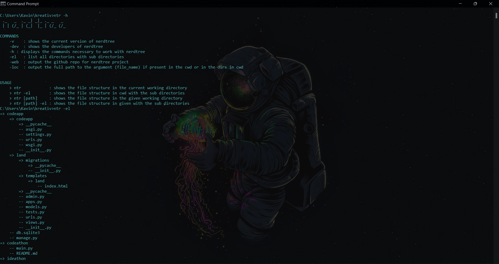

# Nerdtree

*cmd command in windows to show the directory structure layout*

<h1>Installation:</h1>


Using git tool:
```
$ git clone "https://github.com/kavinbharathii/nerdtree"
```

Using GitHub:
- Go to the main page of the project
- Download the code as a .zip file
- extract the contents
- follow <b>Configuration</b>

<h1>Configuration:</h1>

- Add the full path to ```setup.py``` in nerdtree.bat
- Add the nerdtree folder to the ```PATH``` variable under Environmental Variables.

<h1>Commands:</h1>

```
-v    : shows the current version of nerdtree
-dev  : shows the developers of nerdtree
-help : displays the commands necessary to work with nerdtree
-el   : list all directories with sub directories
-web  : output the github repo for nerdtree project
-loc  : output the full path to the argument (file_name) if present in the cwd or in the dirs in cwd
-cp   : copy a file to new file if name is specified. Else it creates {original_name}_copy file.
```

<h1>Examples:</h1>

```
$ ntr C:/User/example
```

Or, you can just enter nerdtree to show the directory layout of the current working directory

```
$ ntr
```

<h1>The Result:</h1>


